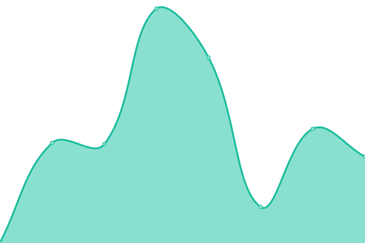
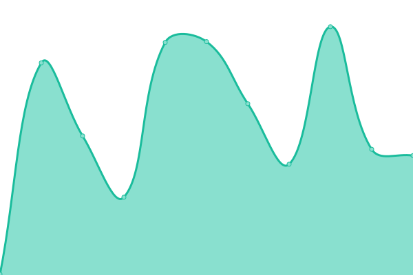
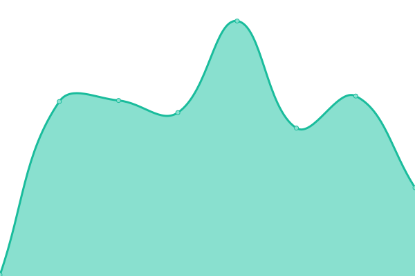
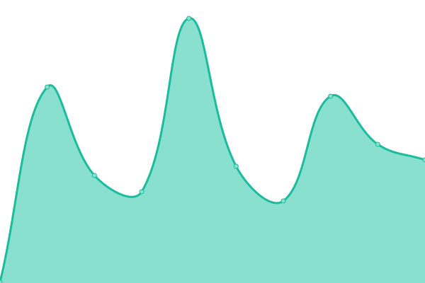

# [📈 Live Status](https://dreamsquad-team.github.io/upptime): <!--live status--> **🟩 All systems operational**

This repository contains the open-source uptime monitor and status page for [DreamSquad](https://dreamsquad.com.br), powered by [Upptime](https://github.com/upptime/upptime).

With [Upptime](https://upptime.js.org), you can get your own unlimited and free uptime monitor and status page, powered entirely by a GitHub repository. We use [Issues](https://github.com/dreamsquad-team/upptime/issues) as incident reports, [Actions](https://github.com/dreamsquad-team/upptime/actions) as uptime monitors, and [Pages](https://dreamsquad-team.github.io/upptime) for the status page.

<!--start: status pages-->
<!-- This summary is generated by Upptime (https://github.com/upptime/upptime) -->
<!-- Do not edit this manually, your changes will be overwritten -->
<!-- prettier-ignore -->
| URL | Status | History | Response Time | Uptime |
| --- | ------ | ------- | ------------- | ------ |
|  [GitHub Status](https://www.githubstatus.com/api/v2/status.json) | 🟩 Up | [git-hub-status.yml](https://github.com/dreamsquad-team/upptime/commits/HEAD/history/git-hub-status.yml) | 

 160ms
     
 | 

<a href="https://upptime.dreamsquad.com.br/history/git-hub-status">100.00%</a>
    

|  [GitLab Status](https://status.gitlab.com) | 🟩 Up | [git-lab-status.yml](https://github.com/dreamsquad-team/upptime/commits/HEAD/history/git-lab-status.yml) | 

 231ms
     
 | 

<a href="https://upptime.dreamsquad.com.br/history/git-lab-status">94.75%</a>
    

|  [Bitbucket Status](https://bitbucket.status.atlassian.com/api/v2/status.json) | 🟩 Up | [bitbucket-status.yml](https://github.com/dreamsquad-team/upptime/commits/HEAD/history/bitbucket-status.yml) | 

 219ms
     
 | 

<a href="https://upptime.dreamsquad.com.br/history/bitbucket-status">100.00%</a>
    

|  [Jira Status](https://jira-software.status.atlassian.com/api/v2/status.json) | 🟩 Up | [jira-status.yml](https://github.com/dreamsquad-team/upptime/commits/HEAD/history/jira-status.yml) | 

 139ms
     
 | 

<a href="https://upptime.dreamsquad.com.br/history/jira-status">99.20%</a>
    

|  [Cloudflare Status](https://www.cloudflarestatus.com/api/v2/status.json) | 🟩 Up | [cloudflare-status.yml](https://github.com/dreamsquad-team/upptime/commits/HEAD/history/cloudflare-status.yml) | 

 188ms
     
 | 

<a href="https://upptime.dreamsquad.com.br/history/cloudflare-status">97.55%</a>
    

<!--end: status pages-->

[**Visit our status website →**](https://dreamsquad-team.github.io/upptime)

## 📄 License

- Powered by: [Upptime](https://github.com/upptime/upptime)
- Code: [MIT](./LICENSE) © [Anand Chowdhary](https://anandchowdhary.com), supported by [Pabio](https://pabio.com)
- Data in the `./history` directory: [Open Database License](https://opendatacommons.org/licenses/odbl/1-0/)
